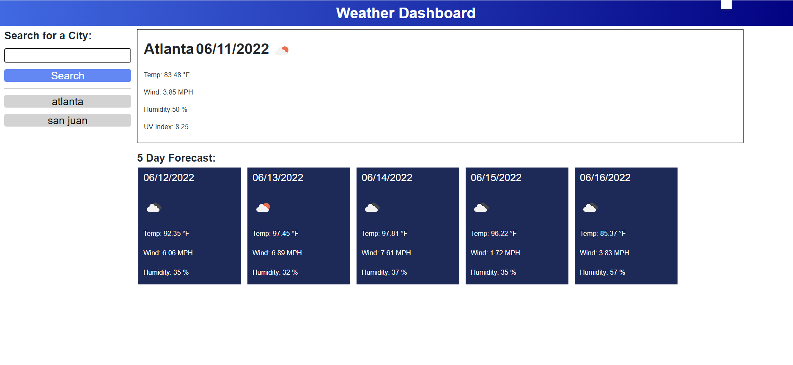
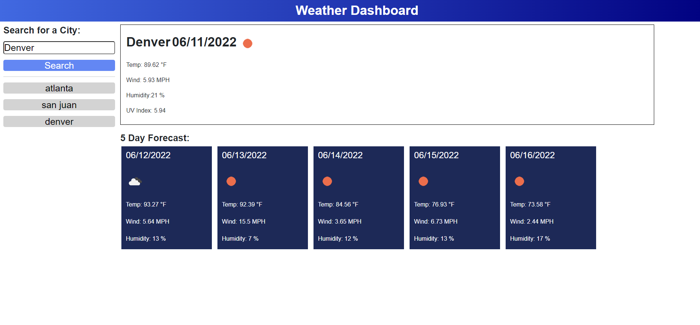

# HW6-WeatherDashboard

### This is Mikhail Sookwah's project of creating a weather dashboard application

This program includes:

* A search function that finds the information by city

    * The geolocation API to find the coordinates for said City

    * Two weather API's that find all the important information about the current weather: Weather Stat, Wind Speed, Temperature, ect

    * Sorts by days and finds each weather prediction in the

* Using localstorange to find and store each succesful result

----------------------------------------------------------------

[Link to the website](https://mikhail25.github.io/HW6-WeatherDashboard/)